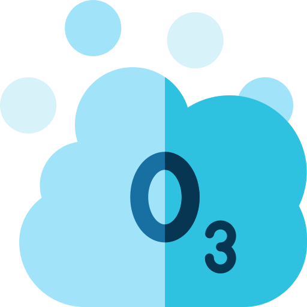

**Uvod**

Spoštovani kolegi, danes se bomo posvetili enemu izmed najpomembnejših ekoloških vprašanj sodobnega časa - ozonski luknji. Konkretno bomo raziskali vlogo halogeniranih ogljikovodikov, kot so freoni, in njihov vpliv na ozonsko plast. S kemijskega stališča bomo raziskali mehanizme, ki stojijo za tem pojavom, ter predstavili osnovne hipoteze o njihovem vplivu.

**Ozonska plast in Njen Pomen**

Preden se poglobimo v vpliv halogeniranih ogljikovodikov, je ključno razumeti pomen ozonske plasti. Ozonska plast, sestavljena iz molekul O3, se nahaja v stratosferi in deluje kot naravni filter za škodljive ultravijolične (UV) žarke Sonca. Ti UV žarki so znani po svoji škodljivosti za živa bitja, saj lahko povzročijo rakavo obolenje kože, mutacije genov in številne druge negativne posledice.

**Halogenirani Ogljikovodiki in Ozonska Luknja**

Eden izmed največjih krivcev za tanjšanje ozonske plasti so halogenirani ogljikovodiki, kemijske spojine, ki vsebujejo halogene elemente, kot so fluor, klor, brom in jod. Med najbolj znane halogenirane ogljikovodike sodijo freoni, ki so bili pogosto uporabljeni v industriji, predvsem kot hladilna sredstva in propulzivne spojine v aerosolih.

**Kemijski Mehanizmi**

Za razumevanje, kako halogenirani ogljikovodiki vplivajo na ozonsko plast, moramo raziskati kemijske mehanizme, ki stojijo za tem pojavom. Ena izmed ključnih reakcij je katalizirana razgradnja ozona s halogeniranimi ogljikovodiki. Na primer, fluorirani in klorirani ogljikovodiki lahko reagirajo z ozonom v prisotnosti UV svetlobe, tvorijoč različne medprodukte, kot so klorovodikova kislina in fluoridi, medtem ko se ozon razgradi v kisik. Ti medprodukti nato lahko nadaljujejo kemijske reakcije, ki nadalje zmanjšujejo koncentracijo ozona v ozonski plasti.

**Hipoteze o Vplivu na Okolje**

Glede na kemijske mehanizme, ki smo jih pravkar raziskali, obstajajo številne hipoteze o vplivu halogeniranih ogljikovodikov na ozonsko plast in okolje kot celoto. Eno izmed najbolj sprejetih je, da uporaba halogeniranih ogljikovodikov, zlasti freonov, vodi v tanjšanje ozonske plasti in posledično povečuje stopnjo UV sevanja, ki doseže Zemljino površje. To lahko ima številne negativne posledice, vključno z večjim tveganjem za kožnega raka, škodo za žive organizme in ekosisteme ter vpliv na podnebne spremembe.

**Napredne Analitične Metode**

Za preučevanje vpliva halogeniranih ogljikovodikov na ozonsko plast so bile razvite številne napredne analitične metode. Na primer, spektroskopske tehnike, kot je infrardeča spektroskopija, omogočajo identifikacijo in kvantifikacijo halogeniranih spojin v ozračju. Poleg tega se uporabljajo tudi modeliranje atmosferskih procesov, ki omogočajo napovedovanje širjenja halogeniranih ogljikovodikov v ozračju in njihov vpliv na ozonsko plast.

**Regulativni Ukrepi**

Zaradi prepoznanih tveganj za ozonsko plast in okolje so bile sprejete številne regulativne ukrepe za zmanjšanje uporabe halogeniranih ogljikovodikov. Na mednarodni ravni je bil leta 1987 sprejet Montrealski protokol, ki predvideva postopno zmanjšanje proizvodnje in uporabe halogeniranih spojin, vključno s freoni. Ta protokol je bil ključen korak k zmanjšanju obremenitve ozonske plasti in zaščiti okolja.

**Zaključek**

Halogenirani ogljikovodiki, zlasti freoni, predstavljajo resno grožnjo ozonski plasti in okolju kot celoti. Razumevanje kemijskih mehanizmov, ki stojijo za njihovim vplivom, je ključno za oblikovanje učinkovitih ukrepov za zaščito ozonske plasti in preprečevanje nadaljnjega tanjšanja. Z razvojem naprednih analitičnih metod in sprejetjem regulativnih ukrepov lahko prispevamo k ohranjanju zdravega ozračja in zaščiti življenja na Zemlji. Hvala.