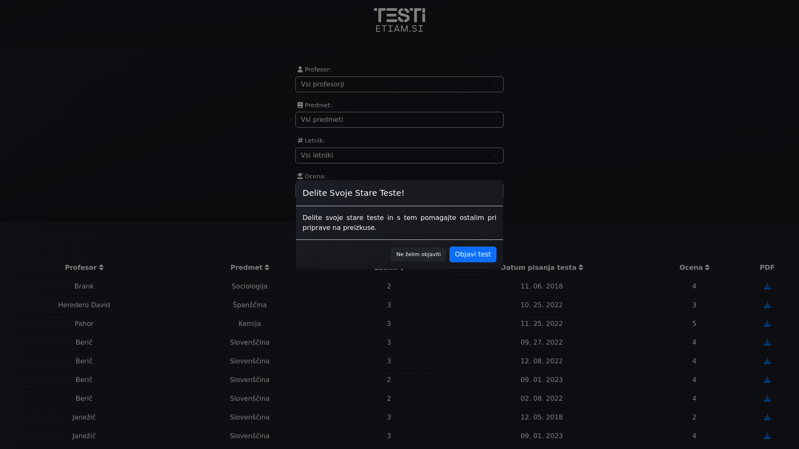

Description

**testi.etiam.si** serves as an invaluable online resource dedicated to enhancing the educational experience by facilitating the sharing of school tests and quizzes. Its primary function is to provide a platform where students can access a repository of past tests and assessments contributed by their peers. This allows learners to reinforce their understanding of course material and prepare more effectively for upcoming evaluations.

One of the key features of **testi.etiam.si** is its comprehensive search functionality, enabling users to filter tests based on various criteria such as academic year, instructor, grade level, and subject area. This empowers students to pinpoint relevant resources tailored to their specific educational needs, thus streamlining the studying process and maximizing productivity.

Furthermore, **testi.etiam.si** fosters a sense of community collaboration by encouraging students to share their own test materials for the benefit of their peers. By promoting knowledge exchange and peer learning, the platform cultivates a supportive learning environment where students can collectively strive for academic excellence.

Our overarching goal with **testi.etiam.si** is to empower students to achieve their full potential in academic assessments. By providing easy access to a diverse range of test materials and fostering collaborative learning, we aim to equip learners with the tools they need to succeed in their educational endeavors and beyond.

